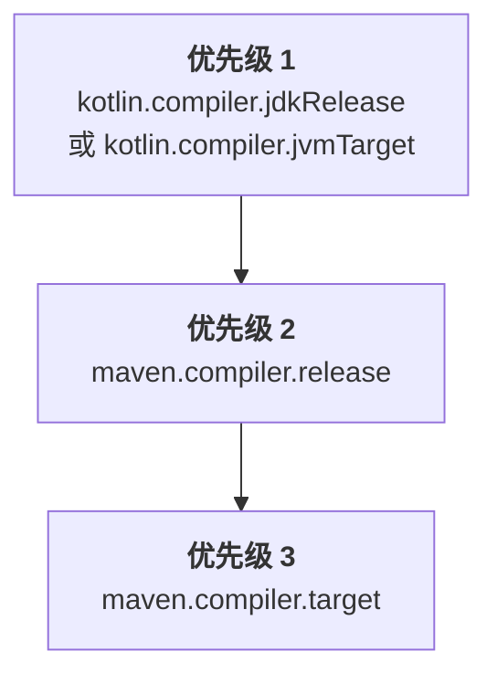

[//]: # (title: 配置 Maven 项目)

当你向已有的 Java Maven 项目引入 Kotlin, 或者创建新的 Kotlin Maven 项目时,
需要添加 Kotlin Maven 插件, 来编译 Kotlin 源代码和模块.

目前只支持 Maven v3.

## 自动配置 {id="automatic-configuration"}

你可以使用 `<extensions>` 选项, 简化 Java-Kotlin 混合项目和纯 Kotlin 项目的 Maven 配置.
这种方式可以节省你的时间, 因为不需要配置 Maven 编译器插件.

要应用 Kotlin Maven 插件, 并使用 `<extensions>` 选项, 请更新你的 `pom.xml` 构建文件, 内容如下:

1. 在 `<properties>` 节中, 定义 Kotlin 和 JVM 的目标版本:

   ```xml
   <properties>
       <maven.compiler.release>17</maven.compiler.release>
       <kotlin.version>%kotlinVersion%</kotlin.version>
   </properties>
   ```

2. 在 `<build><plugins>` 节中, 添加 Kotlin Maven 插件, 启用 `<extensions>` 选项:

   ```xml
   <build>
       <plugins>
           <!-- Kotlin 编译器插件配置 -->
           <plugin>
               <groupId>org.jetbrains.kotlin</groupId>
               <artifactId>kotlin-maven-plugin</artifactId>
               <version>${kotlin.version}</version>
               <extensions>true</extensions> <!-- 启用扩展 -->
           </plugin>
           <!-- 使用 extensions 时, 不需要配置 Maven 编译器插件 -->
       </plugins>
   </build>
   ```

`<extensions>` 选项会进行以下配置:

* 如果 `src/main/kotlin` 和 `src/test/kotlin` 目录已存在, 但在插件配置中没有指定, 则将它们注册为源代码根目录.
* 如果项目中没有定义 [`kotlin-stdlib` 依赖项](maven-set-dependencies.md#dependency-on-the-standard-library), 则自动添加.
* 向你的构建添加 `compile`, `test-compile`, `kapt` 和 `test-kapt` 的 execution, 并绑定到相应的 [生命周期阶段](https://maven.apache.org/guides/introduction/introduction-to-the-lifecycle.html).
  因此, 你不需要在 `<executions>` 节中, 为 `kapt`, Kotlin 的 `compile`, 以及 Java 的 `compile` execution
  手动设置 `<id>` 和 `<goals>`, 来确保它们按正确顺序运行.
* [自动对齐 JVM 目标版本和项目中配置的 Java 编译器版本.](#jvm-target-version)

如果你的项目混合了 Java 和 Kotlin 代码, 这个配置可以确保:

* Kotlin 代码首先编译.
* Java 代码在 Kotlin 之后编译, 并且可以引用 Kotlin 类.
* 默认的 Maven 行为不会覆盖插件顺序.

extension 配置会替换整个 `<executions>` 节. 如果你需要配置某个 execution,
请参见 [编译 Kotlin 和 Java 源代码](#compile-kotlin-and-java-sources) 中的示例.

> 如果多个构建插件覆盖了默认的生命周期, 并且你也启用了 `<extensions>` 选项,
> 那么 `<build>` 节中的最后一个插件对生命周期设置具有优先权. 所有较早的生命周期设置变更都会被忽略.
>
{style="note"}

### JVM 目标版本 {id="jvm-target-version"}

`<extensions>` 选项会确保 Kotlin 和 Maven 编译器的目标字节码版本相同.

Kotlin Maven 插件会按照以下顺序, 自动解析 JVM 目标版本:



#### Kotlin 编译器版本 {id="kotlin-compiler-versions"}

如果项目中定义了 `kotlin.compiler.jdkRelease` 或 `kotlin.compiler.jvmTarget` 属性, 那么会优先使用这个属性中设置的版本.

请注意, 这些 Kotlin 编译器选项的行为不同:

| Kotlin 编译器选项            | 控制输出的字节码版本 | 将 API 限制到特定的 JDK                                            |
|------------------------------|----------------------|--------------------------------------------------------------------|
| `kotlin.compiler.jvmTarget`  | 是                   | 对代码中的 JDK API 没有限制                                        |
| `kotlin.compiler.jdkRelease` | 是                   | 是 - 只允许特定的 API 版本 (等同于 Java 的 `--release` 编译器选项) |

> 不要同时为 `kotlin.compiler.jdkRelease` 和 `kotlin.compiler.jvmTarget` 设置不同的 JDK 选项.
> 否则, 会发生错误.
>
{style="note"}

#### Maven 编译器版本 {id="maven-compiler-versions"}

* 如果 `kotlin.compiler.jdkRelease` 和 `kotlin.compiler.jvmTarget` 选项都没有设置,
  插件会使用 `maven.compiler.release` 的版本.

  `maven.compiler.release` 的版本可以通过项目属性定义, 也可以在 `maven-compiler-plugin` 配置中定义.
* 如果 Maven release 版本没有设置, 插件会使用 `maven.compiler.target` 的版本.

  它可以通过项目属性定义, 也可以在 `maven-compiler-plugin` 配置中定义.

请注意, Maven 编译器的 `target` 和 `release` 选项的行为不同:

| Maven 编译器选项         | 设置 Kotlin 的 `jvmTarget` | 设置 Kotlin 的 `jdkRelease` | 将 API 限制到特定的 JDK            |
|--------------------------|----------------------------|-----------------------------|------------------------------------|
| `maven.compiler.target`  | 是                         | 否                          | 否 - 构建的 JDK classpath 仍然可见 |
| `maven.compiler.release` | 是                         | 是                          | 是 - 只允许特定的 API 版本         |

> `<extensions>` 选项只检查项目级属性和全局的 `maven-compiler-plugin` 配置.
> 它不检查插件的 `<executions>` 节中定义的配置.
>
{style="note"}

### Maven 编译器版本 {id="maven-compiler-version"}

目前, 与 `<extensions>` 一起使用的 Maven 编译器插件的默认版本是 **%mavenExtensionsVersion%**.
你可以单独设置不同的版本:

```xml
<build>
    <plugins>
        <!-- Kotlin 编译器插件配置 -->
        <plugin>
            <groupId>org.jetbrains.kotlin</groupId>
            <artifactId>kotlin-maven-plugin</artifactId>
            <version>${kotlin.version}</version>
            <extensions>true</extensions>
        </plugin>
        <!-- 针对 Java 类的 Maven 编译器插件配置 -->
        <plugin>
            <groupId>org.apache.maven.plugins</groupId>
            <artifactId>maven-compiler-plugin</artifactId>
            <version>%mavenPluginVersion%</version>
        </plugin>
    </plugins>
</build>
```

## 手动配置 {id="manual-configuration"}

如果没有在 Kotlin Maven 插件中启用 `<extensions>`, 你需要手动配置项目,
以确保源代码能够正确编译.

你可以将 Maven 项目配置为 [编译 Kotlin 和 Java 源代码](#compile-kotlin-and-java-sources) 的组合,
或者 [编译纯 Kotlin 源代码](#compile-kotlin-only-sources).

### 编译 Kotlin 和 Java 源代码 {id="compile-kotlin-and-java-sources"}

要编译同时包含 Kotlin 和 Java 源代码文件的项目, 请确保 Kotlin 编译器在 Java 编译器之前运行.

在 Kotlin 声明被编译为 `.class` 文件之前, Java 编译器无法看到这些声明.
如果你的 Java 代码使用了 Kotlin 类, 这些类必须先编译, 才能避免 `cannot find symbol` 错误.

Maven 根据两个主要因素确定插件的执行顺序:

* `pom.xml` 文件中插件声明的顺序.
* 内置的默认 execution, 例如 `default-compile` 和 `default-testCompile`, 这些 execution 始终在用户自定义的 execution 之前运行,
  无论它们在 `pom.xml` 文件中的位置如何.

要控制执行顺序, 请进行以下设置:

* 在 `maven-compiler-plugin` 之前声明 `kotlin-maven-plugin`.
* 禁用 Java 编译器插件的默认 execution.
* 添加自定义 execution, 明确的控制编译阶段.

> 你可以使用 Maven 中特殊的 `none` 阶段, 来禁用默认 execution.
>
{style="note"}

要应用 Kotlin Maven 插件, 请更新你的 `pom.xml` 构建文件, 内容如下:

```xml
<build>
    <plugins>
        <!-- Kotlin 编译器插件配置 -->
        <plugin>
            <groupId>org.jetbrains.kotlin</groupId>
            <artifactId>kotlin-maven-plugin</artifactId>
            <version>${kotlin.version}</version>
            <executions>
                <execution>
                    <id>kotlin-compile</id>
                    <phase>compile</phase>
                    <goals>
                        <goal>compile</goal>
                    </goals>
                    <configuration>
                        <sourceDirs>
                            <sourceDir>src/main/kotlin</sourceDir>
                            <!-- 确保 Kotlin 代码可以引用 Java 代码 -->
                            <sourceDir>src/main/java</sourceDir>
                        </sourceDirs>
                    </configuration>
                </execution>
                <execution>
                    <id>kotlin-test-compile</id>
                    <phase>test-compile</phase>
                    <goals>
                        <goal>test-compile</goal>
                    </goals>
                    <configuration>
                        <sourceDirs>
                            <sourceDir>src/test/kotlin</sourceDir>
                            <sourceDir>src/test/java</sourceDir>
                        </sourceDirs>
                    </configuration>
                </execution>
            </executions>
        </plugin>

        <!-- Maven 编译器插件配置 -->
        <plugin>
            <groupId>org.apache.maven.plugins</groupId>
            <artifactId>maven-compiler-plugin</artifactId>
            <version>3.15.0</version>
            <executions>
                <!-- 禁用默认的 execution -->
                <execution>
                    <id>default-compile</id>
                    <phase>none</phase>
                </execution>
                <execution>
                    <id>default-testCompile</id>
                    <phase>none</phase>
                </execution>

                <!-- 定义自定义 execution -->
                <execution>
                    <id>java-compile</id>
                    <phase>compile</phase>
                    <goals>
                        <goal>compile</goal>
                    </goals>
                </execution>
                <execution>
                    <id>java-test-compile</id>
                    <phase>test-compile</phase>
                    <goals>
                        <goal>testCompile</goal>
                    </goals>
                </execution>
            </executions>
        </plugin>
    </plugins>
</build>
```

这个配置会确保:

* Kotlin 代码首先编译.
* Java 代码在 Kotlin 之后编译, 并且可以引用 Kotlin 类.
* 默认的 Maven 行为不会覆盖插件顺序.

关于 Maven 如何处理插件 execution,
更多详情请参见 Maven 官方文档中的 [默认插件 execution ID 指南](https://maven.apache.org/guides/mini/guide-default-execution-ids.html).

### 编译纯 Kotlin 源代码 {id="compile-kotlin-only-sources"}

要编译只包含 Kotlin 源代码文件的项目, 请声明源代码根目录, 并配置 Kotlin Maven 插件:

1. 在 `<build>` 节中, 指定源代码目录:

    ```xml
    <build>
        <sourceDirectory>src/main/kotlin</sourceDirectory>
        <testSourceDirectory>src/test/kotlin</testSourceDirectory>
    </build>
    ```

2. 确保 Kotlin Maven 插件已应用:

    ```xml
    <build>
        <plugins>
            <plugin>
                <groupId>org.jetbrains.kotlin</groupId>
                <artifactId>kotlin-maven-plugin</artifactId>
                <version>${kotlin.version}</version>
                <executions>
                    <execution>
                        <id>compile</id>
                        <goals>
                            <goal>compile</goal>
                        </goals>
                    </execution>
                    <execution>
                        <id>test-compile</id>
                        <goals>
                            <goal>test-compile</goal>
                        </goals>
                    </execution>
                </executions>
            </plugin>
        </plugins>
    </build>
    ```

### 设置 JDK 版本 {id="set-jdk-version"}

Kotlin 支持 [Maven 工具链](https://maven.apache.org/guides/mini/guide-using-toolchains.html),
它可以帮助你的管理构建中的 JDK 版本.

如果你在构建中配置了 `maven-toolchains-plugin`, 可以指定用于 Kotlin 编译的 JDK 版本,
这个版本独立于运行 Maven 的 JVM 版本 (在 `JAVA_HOME` 路径中设置).
之后, Kotlin Maven 插件会自动选取指定的 JDK 工具链.

这个功能让你能够配置一个统一的工具链, 控制构建中所有插件使用的 JDK, 包括 Kotlin 编译.
例如:

```xml
<plugin>
    <groupId>org.apache.maven.plugins</groupId>
    <artifactId>maven-toolchains-plugin</artifactId>
    <version>3.2.0</version>
    <executions>
        <execution>
            <goals>
                <goal>toolchain</goal>
            </goals>
        </execution>
    </executions>
    <configuration>
        <toolchains>
            <jdk>
                <version>21</version>
            </jdk>
        </toolchains>
    </configuration>
</plugin>
```

请注意设置 JDK 版本的不同方式的优先级:

```Mermaid
graph TD
    A["<b>优先级 1</b><br/>kotlin-maven-plugin 的 jdkHome 选项"]
    B["<b>优先级 2</b><br/>maven-toolchains-plugin <br/>中设置的 JDK 版本"]
    C["<b>优先级 3</b><br/>JAVA_HOME 版本"]

    A --> B
    B --> C
```

* `kotlin-maven-plugin` 配置的 `jdkHome` 选项中设置的 JDK 版本,
  始终优先于工具链版本.
* `maven-toolchains-plugin` 中的 JDK 版本,
  会覆盖 `JAVA_HOME` 路径中设置的 JDK 版本.

你也可以使用插件专有的 `<jdkToolchain>` 选项, 直接设置 `kotlin-maven-plugin` 的工具链中的 JDK 版本.
与使用 `maven-toolchains-plugin` 相比, 这个参数只影响 Kotlin 编译, 对构建中的其他插件没有影响.

> 目前, 将 `maven-toolchains-plugin` 配置为使用特定的 JDK 版本, [不会影响 `kotlin-maven-plugin` 的 `kapt` 和 `test-kapt` goal](https://youtrack.jetbrains.com/issue/KT-79897).
> 请改为在 `JAVA_HOME` 路径中设置需要的版本.
>
{style="note"}

#### 使用 JDK 17 {id="use-jdk-17"}

要使用 JDK 17, 请在你的 `.mvn/jvm.config` 文件中, 添加以下内容:

```properties
--add-opens=java.base/java.lang=ALL-UNNAMED
--add-opens=java.base/java.io=ALL-UNNAMED
```

## 下一步做什么? {id="whats-next"}

[在你的 Kotlin Maven 项目中设置依赖项](maven-set-dependencies.md)
